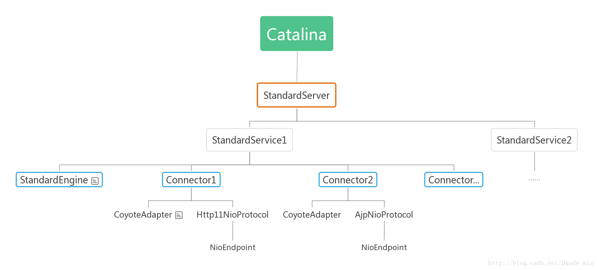
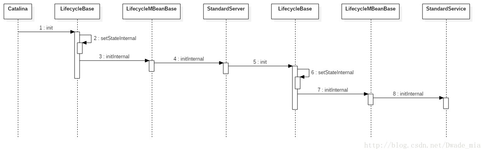
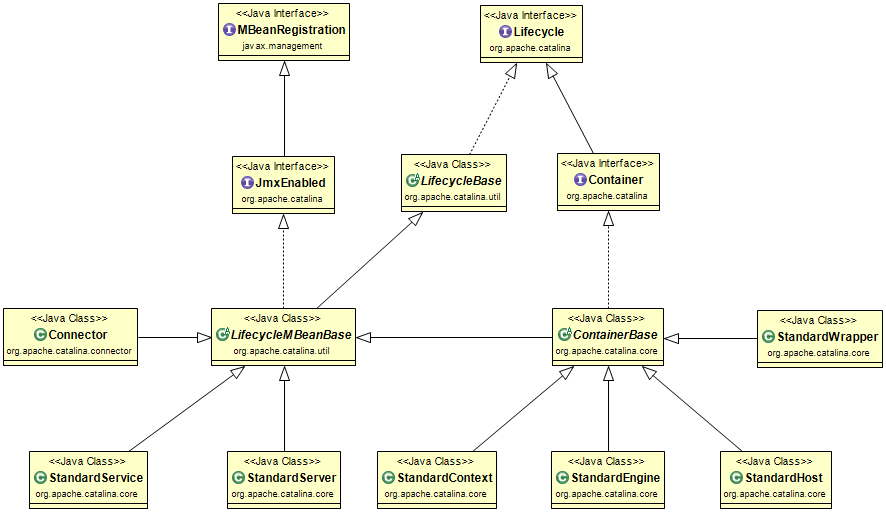
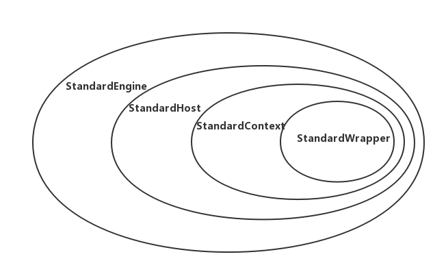

## 编译源码
1. 下载[tomcat8源码](http://tomcat.apache.org/download-80.cgi)导入Idea；
2. 添加[pom.xml](./pom.xml)转换成maven项目；
3. 删除[webapps/examples](./webapps/examples)文件夹，防止出现ClassNotFoundException；
4. 启动[Bootstrap.main()](./java/org/apache/catalina/startup/Bootstrap.java)方法

##
默认情况下，Server只有一个Service组件，Service组件先后对Engine、Connector进行初始化。
而Engine组件并不会在初始化阶段对子容器进行初始化，Host、Context、Wrapper容器的
初始化是在start阶段完成的。tomcat默认会启用HTTP1.1和AJP的Connector连接器，
这两种协议默认使用Http11NioProtocol、AJPNioProtocol进行处理。

**Catalina初始化**

**Catalina#load()时序图**
时序图.jfif)

**StandardServer初始化时序图**

## Tomcat Container关系图

StandardEngine、StandardHost、StandardContext、StandardWrapper各个容器存在父子关系，
一个父容器包含多个子容器，并且一个子容器对应一个父容器。Engine是顶层父容器，它不存在父容器。
各个组件的包含关系如下图所示，默认情况下，StandardEngine只有一个子容器StandardHost，
一个StandardContext对应一个webapp应用，而一个StandardWrapper对应一个webapp里面的一个Servlet。

由类图可知，StandardEngine、StandardHost、StandardContext、StandardWrapper都是继承至ContainerBase，
各个容器的启动，都是由父容器调用子容器的start方法，也就是说由StandardEngine启动StandardHost，
再StandardHost启动StandardContext，以此类推。

它们都是继承至ContainerBase，当调用start启动Container容器时，首先会执行ContainerBase#start，
它会寻找子容器，并且在线程池中启动子容器，StandardEngine也不例外。

